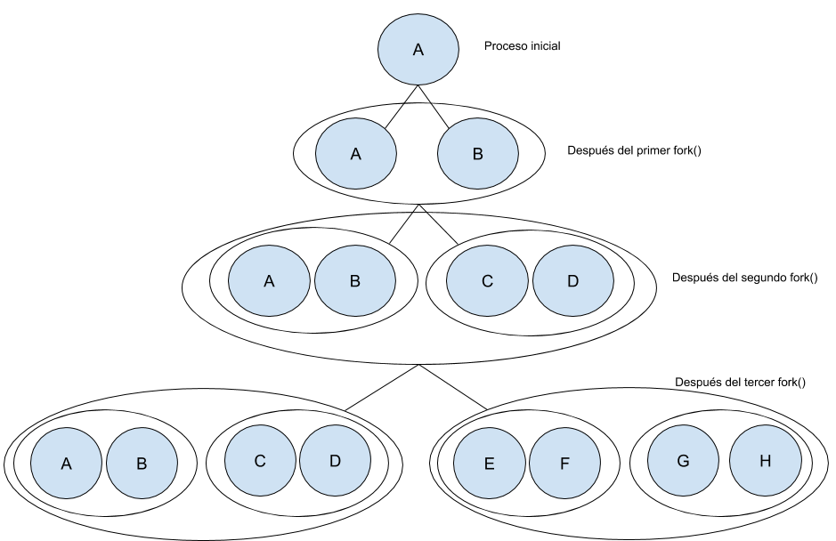
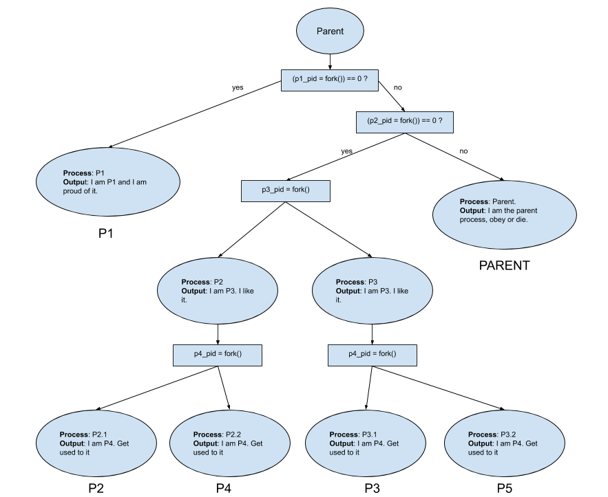
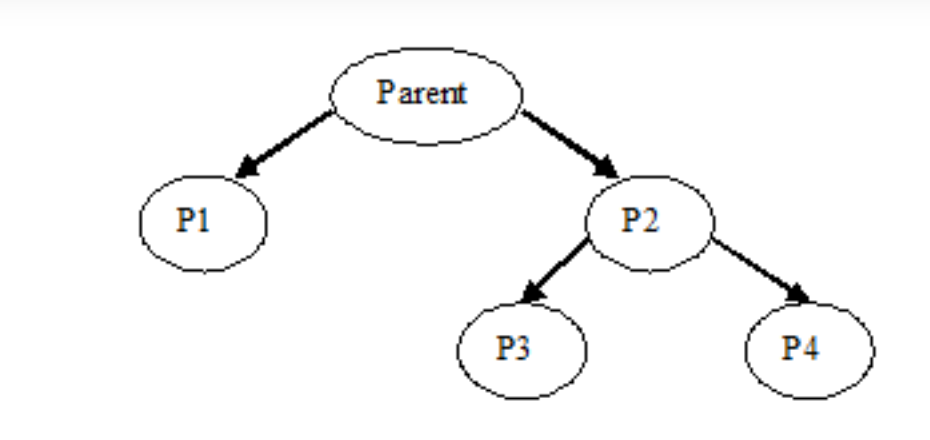
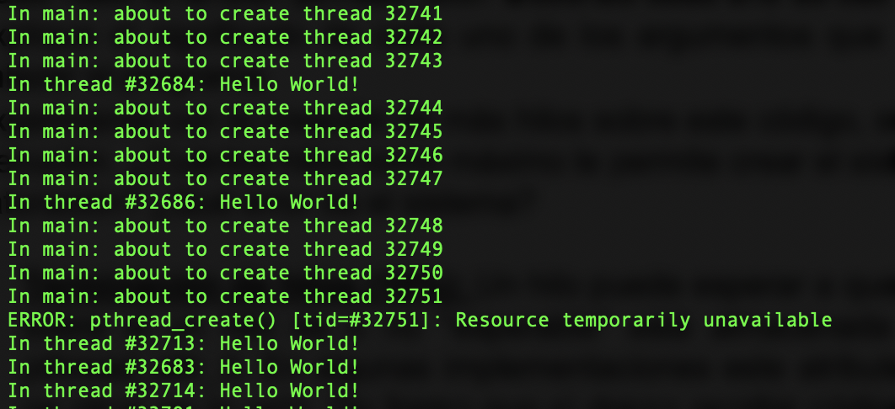

# Practica 2: Programación Concurrente

La guía de trabajo de esta practica, puede visualizarse [aqui](/media/guia.pdf).

## Desarrollo de la guía ##

### Parte 1: Procesos ###
#### A. Fork simple: ####
para este punto, se escribió el código [main.cpp](/project/01.simpleFork/main.cpp) que se encuentra en la ruta `/project/01.simpleFork/` de este repositorio. Se compiló y ejecutó con las instrucciones:

```
$ gpp main.cpp
$ ./a.out
```

- En este punto, se identificó que el valor de la variable `x` definida dentro del código, es igual para el proceso padre y el proceso hijo, esto debido a que se encuentra declarada antes de la línea que hace el llamado a la función `fork()`.
- La asignación de ID's que se hace para el proceso padre o hijos, varia con cada ejecucion del programa realizado, por lo que es una asignación hecha por el sistema operativo. Es posible diferenciar y obtener dichos identificadores con las funciones `getpid()` y `getppid()`, pero no es posible predecir el valor con alguna regla definida.
- Para poder diferenciar el o los ID's que serán asignados al proceso hijo y al proceso padre, se debe almacenar el valor devuelto por la función `fork()`, donde al crearse los procesos correspondientes (hijo y padre) se puede identificar cada uno teniendo presente que se devuelve `0` al proceso hijo y el `pid` generado para el nuevo proceso, al proceso padre. Así, usando un condicional, se podria identificar si es el padre o el hijo de la siguiente forma:

    ```
    int process = fork();
    if(process > 0){
        // proceso padre
    } else {
        // proceso hijo
    }
    ```
    De esta manera es posible diferenciar el id del proceso asignados al hijo y al padre.

#### B. Fork no tan simple: ####
Se escribió el código [main.cpp](/project/02.noSoSimpleFork/main.cpp) que se encuentra en la ruta `/project/02.noSoSimpleFork/` de este repositorio. Se compiló y ejecutó con las instrucciones:

```
$ gpp main.cpp
$ ./a.out
```
- Se identificó que se hizo un llamado en 3 lineas consecutivas con la función `fork()`. El resultado de correr el programa es el siguiente:
    ```
    Esta linea es de pid 17818, valor = 1, valor de x es 16807
    Esta linea es de pid 17818, valor = 2, valor de x es 282475249
    Esta linea es de pid 17822, valor = 1, valor de x es 16807
    Esta linea es de pid 17822, valor = 2, valor de x es 282475249
    Esta linea es de pid 17820, valor = 1, valor de x es 16807
    Esta linea es de pid 17820, valor = 2, valor de x es 282475249
    Esta linea es de pid 17819, valor = 1, valor de x es 16807
    Esta linea es de pid 17819, valor = 2, valor de x es 282475249
    Esta linea es de pid 17824, valor = 1, valor de x es 16807
    Esta linea es de pid 17824, valor = 2, valor de x es 282475249
    Esta linea es de pid 17823, valor = 1, valor de x es 16807
    Esta linea es de pid 17823, valor = 2, valor de x es 282475249
    Esta linea es de pid 17821, valor = 1, valor de x es 16807
    Esta linea es de pid 17821, valor = 2, valor de x es 282475249
    Esta linea es de pid 17825, valor = 1, valor de x es 16807
    Esta linea es de pid 17825, valor = 2, valor de x es 282475249
    ```
    Lo que equivale a 8 llamados del ciclo `for` asociado. Esto se debe a que por cada llamado del `fork()`, se crea un nuevo proceso a partir del anterior, lo que puede ser representado a partir de un arbol binario, donde cada nivel del arbol representa un llamado a la función `fork()` dentro de la misma secuencia.
    
    

- Para poder crear únicamente 3 procesos, partimos de la siguiente ejecución (omitiendo el resto del código):
    ```
    pid_1 = fork();
    pid_2 = fork();

    printf("%d %d\n", pid_1, pid_2);
    ```
    Lo cual nos genera la siguiente salida:
    ```
    20497 20498
    20497 0
    0 20499
    0 0
    ```
    Podemos ignorar únicamente el proceso hijo que retorna la línea `0 0` con el siguiente condicional:
    ```
    if(pid_1 != 0 || pid_2 != 0)
    ```
    Así solo ignoramos el caso en el que `pid_1` y `pid_2` valen `0`. Luego, la ejecución la podemos encapsular en una función, de la siguiente manera:
    ```
    void runProgram() {
    pid_t pid;
    int i;
    int x = 0;
    char buf[BUF_SIZE];

    pid = getpid();
    for (i = 1; i <= MAX_COUNT; i++){
        x = rand();
        sprintf(
            buf,
            "Esta linea es de pid %d, valor = %d, valor de x es %d\n",
            pid, i, x);
        write(1, buf, strlen(buf));
    }
    ```
    La solución final puede verse [aquí](/project/02.noSoSimpleFork/mainModified.cpp).

#### C. Fork complejo: ####
Al ejecutar el programa de la ruta `/project/03.complexFork/main.cpp`, el cual puede visualizarse [aquí](/project/03.complexFork/main.cpp), con la misma forma de compilacion realizada en los problemas anteriores, podemos evidenciar lo siguiente:

- Funcionamiento: El programa lo que esta haciendo es crear dos procesos y diferenciar el padre del hijo, para asignar una ejecución diferente usando un `if`. En este desarrollo, se observa que el padre realiza un llamado a la función `parentProcess(void)` mientras que el proceso hijo, hace el llamado a la función `childProcess(void)`.
- Salida: Se esta realizando 20 iteraciones para el padre y el hijo, con tiempos donde el programa se detiene de manera progresiva entre 1 y 5 segundos, de manera creciente para el proceso padre, y decreciente para el proceso hijo.
- ¿Justo o Injusto?: Correr muchas veces la instrucción fork causa que el sistema deje de responder, y combinado con el llamado a `sleep()` estariamos durmiendo el procesador lo cual crearia una pila de procesos en espera. Existe un programa denominado ForkBomb, el cual es un tipo de ataque causado por un uso excesivo de `fork()`. Más información sobre el ForkBomb [aquí](https://www.geeksforgeeks.org/fork-bomb/).

#### D. Comparando Tiempos: ####
Para este desarrollo, se escribió el primer programa en la ruta `/project/04.comparingTimes/mainA.cpp`, el cual puede visualizarse [aquí](/project/04.comparingTimes/mainA.cpp), y de la misma manera el segundo programa en la ruta `/project/04.comparingTimes/mainB.cpp` y se puede visualizar [aquí](/project/04.comparingTimes/mainA.cpp). Se compilaron y ejecutaron con las siguientes instrucciones:

Primer programa:
```
$ g++ mainA.cpp -o a.out
$ ./a.out
```

Segundo programa:
```
$ g++ mainB.cpp -o b.out
$ ./b.out
```

Al ejecutarse, podemos ver las siguientes salidas:

- Para `mainA.cpp`:
    ```
    167.000000
    ```

- Para `mainB.cpp`:
    ```
    19.340000
    ```
Como ambos casos muestran un diferencial de tiempo para la ejecución del programa, podemos ver que el uso del `fork()` tiene un tiempo de demora que refleja la creación de procesos, cuya simultaneidad se genera a partir del principio de concurrencia, asignando fracciones de tiempo para cada proceso generado. El segundo caso, al hacer ejecuciones con hilos, estos se ejecutan de manera paralela, lo cual no detiene la ejecución del programa, pues en la creación de cada hilo, cada uno de estos corre de manera independiente.

#### E. Mas de Fork: ####
Para este desarrollo, se escribió y adaptó el código al programa en la ruta `/project/05.moreFork/main.cpp`, el cual puede visualizarse [aquí](/project/05.moreFork/main.cpp):
- Cantidad de procesos: En este caso, es posible ver que se crearon 6 procesos en total (contando con el padre) ó 5 sin contar el proceso padre, esto puede identificarse a partir del siguiente árbol:
  

- Corrección realizada para mostrar el siguiente árbol: Para realizar el presente arbol


    Se prodece a reemplazar el código existente, por el codigo que se encuentra en [mainModified.cpp](project/05.moreFork/mainModified.cpp):
    ```
    int main(){
        int p1_pid = -1;
        int p2_pid = -1;

        if((p1_pid = fork()) == 0){
            printf("I am P1.\n");
        } else {
            printf("I am P2.\n");
            if ((p2_pid = fork()) == 0){
                printf("I am P3.\n");
            } else {
                printf("I am P4.\n");
            }
        }
    }
    ```

-  Modificación para asegurar P4 después de P1: Se alternan los condicionales, acá se ilustra que el valor que devuelve `fork()` siempre es primero el valor del proceso creado, que este es devuelto al proceso padre, por lo que estamos ubicados en el proceso padre al inicio, por lo tanto en el condicional que evalua la expresion `(p1_pid = fork()) == 0` dara como false en el primer caso. Así teniendo presente esto, para garantizar que P4 sea crado después de P1, solo es cambiar el orden de ejecucion de los condicionales en [mainModified_p4.cpp](project/05.moreFork/mainModified_p4.cpp), (otra de las opciones es cambiar la expresión `(p1_pid = fork()) == 0` por `(p1_pid = fork()) != 0`):
    ```
    int main(){
        int p1_pid = -1;
        int p2_pid = -1;

        if((p1_pid = fork()) == 0){
            printf("I am P2.\n");
            if ((p2_pid = fork()) == 0){
                printf("I am P3.\n");
            } else {
                printf("I am P4.\n");
            }
        } else {
            printf("I am P1.\n");
        }
    }
    ```

### Parte 2: Hilos ###
#### A. Creación básica de hilos: ####
- El archivo presenta un error de compilación. Esto se debe a que falta la cabecera `<pthread.h>`, la cual fue incluida para poder compilar.
- Enumeración de las funciones de la biblioteca pthreads:
    - pthread_create
    - pthread_exit
    - pthread_t: Aunque no es una funcion, es un tipo de dato que hace parte de la biblioteca pthread.
- **pthread_create**: Esta funcion es usada para crear un nuevo hilo, si esta es satisfactoria devuelve un `0`, de lo contrario, devuelve un número indicando el tipo de error.
    
    ```
    int pthread_create(
        pthread_t *thread, 
        const pthread_attr_t *attr,
        void *(*start_routine) (void *), 
        void *arg
        );
    ```
    
    Esta función recibe los siguientes parámetros:
  - `*thread`: referencia al puntero de la variable donde se hace referencia a la variable del tipo `pthread_t`.
  - `*attr`: apunta a una estructura pthread_attr_t cuyo contenido se usa en el momento de la creación del hilo para determinar los atributos para el nuevo hilo.
  - `*(*start_routine) (void *)`: Referencia a la función que ejecutará el thread.
  - `*arg`: argumentos necesarios para poder ejecutar la funcion, referenciada en el parametro `start_routine`.
  
- **pthread_exit**: termina el hilo de llamada y devuelve un valor a través de `retval`:
    ```
    void pthread_exit(void *retval);
    ```
- `gcc -std=c99 -D_POSIX_C_SOURCE=200112L -o prueba1 prueba1.c`:
    - gcc: compilador
    - -std: determina el estandar del lenguaje.
    - -D_POSIX_SOURCE: parametro para indicar que se usaran funciones que no son parte de la libreria estandar de C pero que son parte de POSIX especificando la version que incluye dichas funcionalidades. Ver mas información [aquí](https://www.gnu.org/software/libc/manual/html_node/Feature-Test-Macros.html).
    -  -o: nombre del archivo que se generará despues de la compilación.
- Experimentando con hilos: al definir 100000 hilos ocurre el siguiente error:
  ```
  ERROR: pthread_create() [tid=#32751]: Resource temporarily unavailable
  ```
  La cantidad de threads que se pueden crear son 32751, esto se infiere a partir del `tid` que se presenta en el mensaje de error.
  
  realizando varias pruebas, se llega al mismo error.
#### B. Terminación de hilos: ####
- `pruebajoin.c`:
  - con el detached:
  ```
    In main: about to create thread #0.
    In main: about to create thread #1.
    In main: about to create thread #2.
    In thread #0: starting busy loop...
    In thread #1: starting busy loop...
    In thread #2: starting busy loop...
    In main: about to create thread #3.
    In thread #1: busy loop finished, result is 1.110778e+12.
    In thread #2: busy loop finished, result is 1.110778e+12.
    In thread #3: starting busy loop...
    In thread #0: busy loop finished, result is 1.110778e+12.
    In main: thread 0 finished, return value was 0.
    In main: thread 1 finished, return value was 1.
    In main: thread 2 finished, return value was 2.
    In thread #3: busy loop finished, result is 1.110778e+12.
    In main: thread 3 finished, return value was 3.
    In main: program finished.
  ```
  - sin el detached:
  ```
    In main: about to create thread #0.
    In main: about to create thread #1.
    In main: about to create thread #2.
    In main: about to create thread #3.
    In thread #1: starting busy loop...
    In thread #2: starting busy loop...
    In thread #0: starting busy loop...
    In thread #1: busy loop finished, result is 1.110778e+12.
    In thread #0: busy loop finished, result is 1.110778e+12.
    In thread #3: starting busy loop...
    In thread #2: busy loop finished, result is 1.110778e+12.
    In main: thread 0 finished, return value was 0.
    In thread #3: busy loop finished, result is 1.110778e+12.
    In main: thread 1 finished, return value was 1.
    In main: thread 2 finished, return value was 2.
    In main: thread 3 finished, return value was 3.
    In main: program finished.
  ```
- se puede observar a partir de los resultados anteriores que el parametro `detached` es establecido por defecto.

### Parte 3: Comparacion entre procesos e hilos ###
Para esta parte, se desarrollaron tres programas en la ruta `/project/07.processVSthreads/`:
- [1_main_secuencial.c](/project/07.processVSthreads/1_main_secuencial.c): Programa secuencial ejecutado por un único proceso
- [2_main_forks.c](/project/07.processVSthreads/2_main_forks.c): Programa que crea procesos para desarrollar cada una de las tareas.
- [3_main_threads.c](/project/07.processVSthreads/3_main_threads.c): Programa que realiza las tareas anteriores utilizando procesos ligeros o hilos.