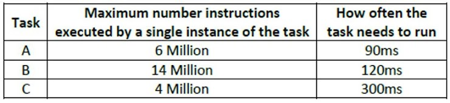

# Pregunta 18 del cuestionario #

Considere una aplicación que consta de 3 tareas denominadas A, B y C. Cada tarea está vinculada a la CPU en forma periódica, es decir, la ejecución de la instrucción es la única razón por la que las tareas toman tiempo de CPU. La fecha límite de cada tarea es cuando la próxima instancia de la tarea está lista para comenzar. Estas tareas tienen las propiedades y requisitos que se muestran en la tabla. Debe suponer que no hay sobrecarga de ningún tipo (incluida la sobrecarga de programación) y que esta máquina ejecuta cualquier instrucción dada exactamente en la misma cantidad de tiempo. Usando el sistema FreeRTOS, escriba las funciones de creación de tareas que llamaría para programar esta aplicación. Las funciones de la tarea no toman argumentos y se denominan `A()`, `B()` y `C ()`. ¡Solo le pedimos que cree las tareas, no que escriba el resto de las funciones principales o de tareas en sí mismas.



```
void A(void *pvParameters) {
    int n = ;
    for(int i = 0; i < n; i++>){
        // TODO: Instruction
    }
}

void B(void *pvParameters) {
    int n = ;
    for(int i = 0; i < n; i++>){
        // TODO: Instruction
    }
}

void C(void *pvParameters) {
    int n = ; 
    for(int i = 0; i < n; i++>){
        // TODO: Instruction
    }
}

int main() {
    xTaskCreate(A, "firstTask", STACK_SIZE, NULL, TASK_PRIORITY, NULL);
    xTaskCreate(B, "secondTask", STACK_SIZE, NULL, TASK_PRIORITY, NULL);
    xTaskCreate(C, "thirdTask", STACK_SIZE, NULL, TASK_PRIORITY, NULL);
    vTaskStartScheduler();
}
```