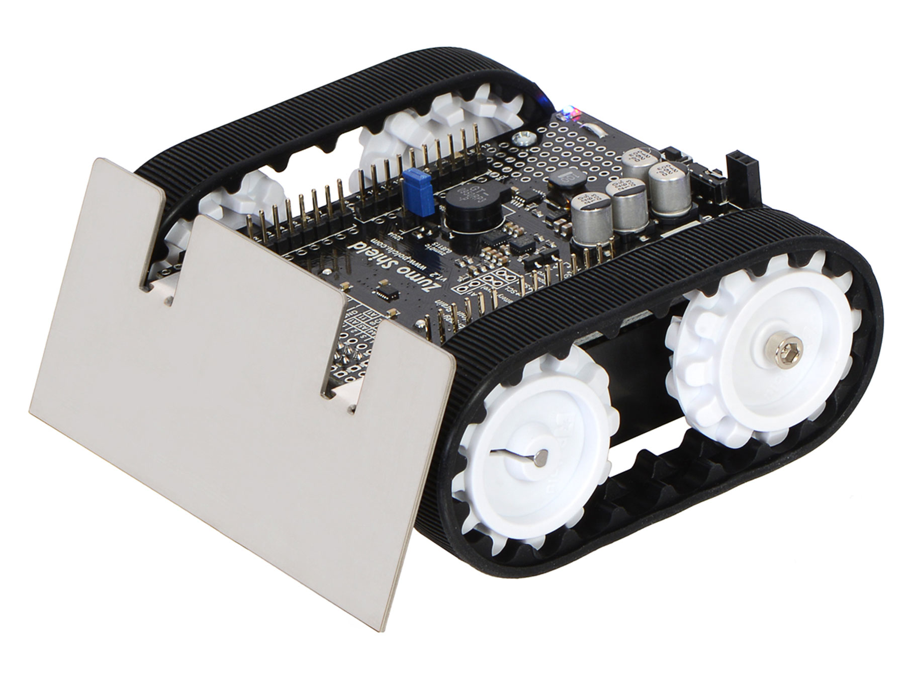
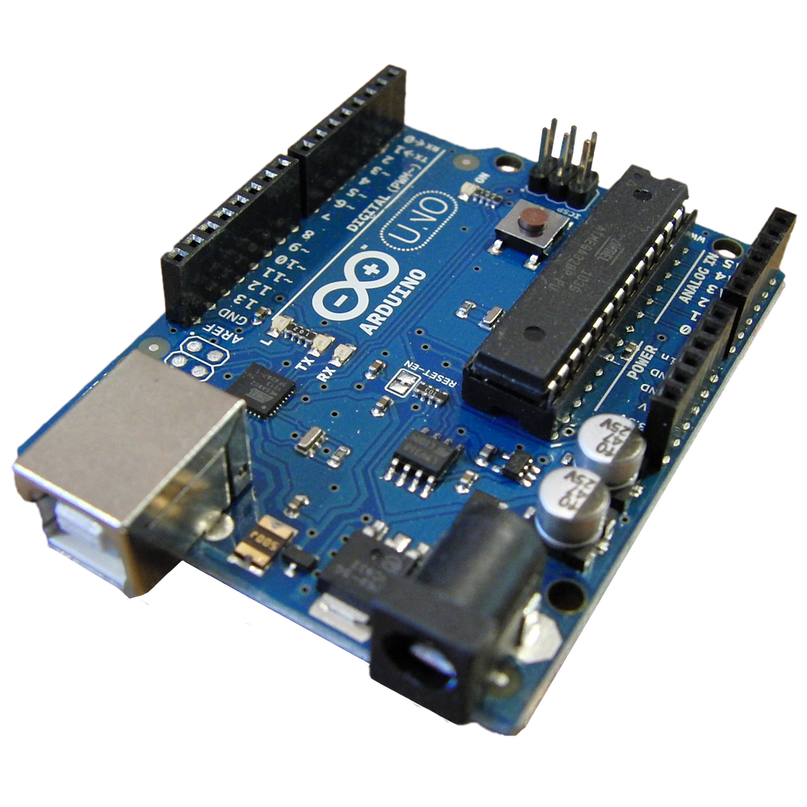
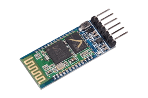
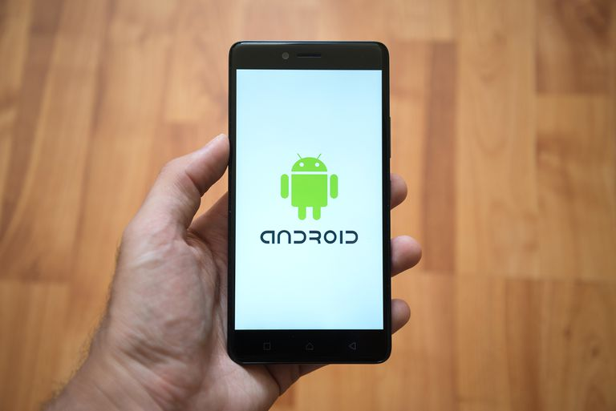

# Sistemas En Tiempo Real: Practica Final

El objetivo de este trabajo final, es presentar una integración de los conceptos aprendidos en la asignatura Tiempo Real, sobre un problema que requiera estos conceptos, con la finalidad de poder realizar varios procesos de manera simultanea. Para esto, se enfocó el trabajo en un vehículo diferencial con el proposito de poder manejar una correcta comunicación con una app desarrollada para teléfonos Android.

[ENLACE DE LA PRESENTACION](https://docs.google.com/presentation/d/1EZawTi2jvQQPIEeSFLhL-LtZWVSkcx7nm1-RAfVVuhY/edit?usp=sharing)

## Hardware ##
- Chassis zumo:
  
  

- Arduino UNO:
  
  

- Bluetooth HC-05:
  
  

- Smartphone Android:
  
  

## Software ##

- Arduino (y las librerias):
  - FreeRTOS
  - ZUMO POLOLU V1.2    
  - LSM303
- Android Studio (y las librerias):
  - [MPAndroidChart](https://github.com/PhilJay/MPAndroidChart)

## Referencias ##
- [Pointers with arrays](https://www.studytonight.com/c/pointers-with-array.php)
- [Pololu documentation zumo v1.2](https://www.pololu.com/docs/0J57/3.d)
- [memset](https://www.tutorialspoint.com/c_standard_library/c_function_memset.htm)
- [atoi](https://www.tutorialspoint.com/c_standard_library/c_function_atoi.htm)